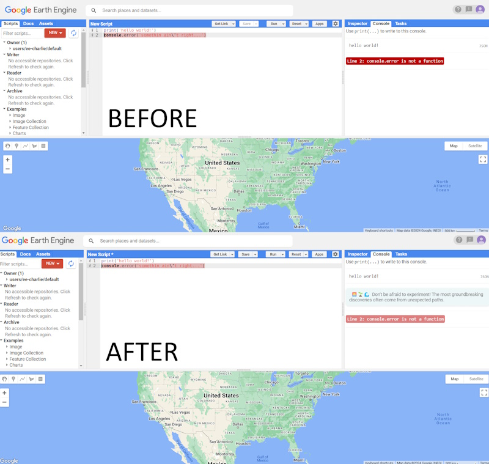

# cerrage-gee-chrome

Google Chrome plugin for manipulating error messages with Cerrage on the Google Earth Engine WebIDE.

Simple restyling of console messages with CSS adjustments, and client-side injection of an uplifting message to let you know it's gonna be OK.

[code.earthengine.google.com](https://code.earthengine.google.com/)
